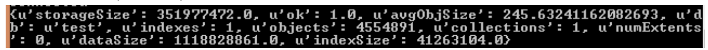
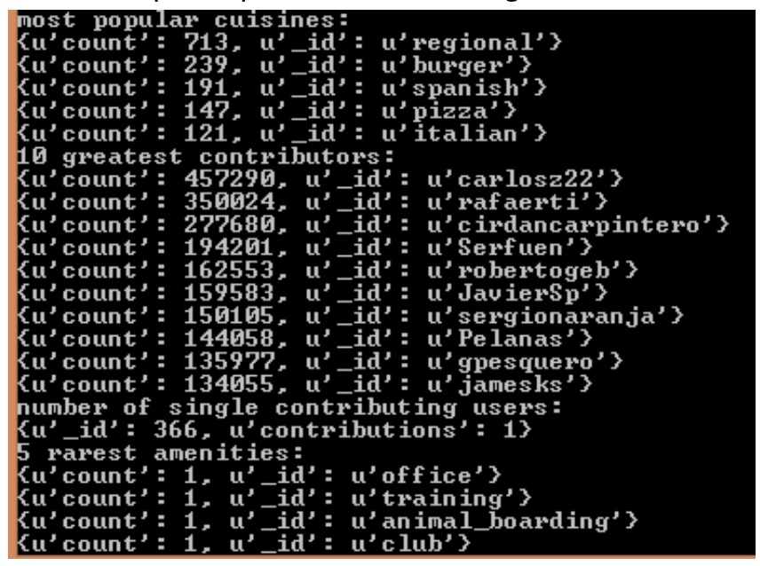

# Madrid_Open_street_map_data_data_analysis

This repository is an example on how to parse open street map data and insert into a mongo database in order to do basic analytics (how many restaurant, most popular cuisines...)

# References

- https://docs.mongodb.com/getting-started/shell/aggregation/
- https://mapzen.com/data/metro-extracts/metro/madrid_spain/
- https://www.openstreetmap.org/export#map=15/40.4422/-3.6853
  
# Structure

This example consists of three different python files, each responsible of a different task. Audit makes sure that the data for the different elements (streets, phone numbers ...) is valid. Clean ensures that all the data is of consistent in form and syntax. Query executes specific queries against the mongo database and outputs the results

# Data Overview

### Simple Queries
 - db.command('dbstats) 
 - len(db.Madrid.distinct('created.user')) => get number of unique users
 - db.Madrid.find({'type':'node'}).count() => number of nodes
 -  db.Madrid.find({'type':'way'}).count() => number of ways
 -  db.Madrid.find({'amenity':'shop'}).count() => number of shops

### Results

### Aggregated Queries

- db.Madrid.aggregate([{'$group':{'_id':'$created.user', 'count':{'$sum':1}}}, {'$sort':{'count':- 1}},{'$limit':10}]) => 10 greatest contributors
- db.Madrid.aggregate([{'$group':{'_id':'$created.user', 'count':{'$sum':1}}}, {'$group':{'_id':'$count', 'contributions':{'$sum':1}}}, {'$sort':{'contributions':1}}, {'$limit':1}]) => number of single contributors
- db.Madrid.aggregate([{'$match':{'amenity':{'$exists':1}}}, {'$group':{'_id':'$amenity', 'count':{'$sum':1}}}, {'$sort':{'count':1}}, {'$limit':5}]) => 5 least popular amenities in Madrid
- db.Madrid.aggregate([{'$match':{'cuisine':{'$exists':1}}}, {'$group':{'_id':'$cuisine', 'count':{'$sum':1}}}, {'$sort':{'count':-1}},{'$limit':5}]) => 5 most popular cuisines

### Results (aggregated queries)

# Other ideas for this dataset

- The data for cuisines and amenities could be audited to produce a general scheme of clear distinct values to avoid values with similar meaning. Thus, queries that use group by cuisine or amenities could be quicker since they need to process less groups. 

- Separate Pizza from Italian => Controversial !!!, :)
